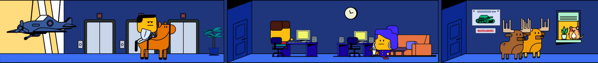

## About me

👋 `Hello,world!`  I'm Shiyu Li, a College Student at the Manitoba Institute and Technology in Winnipeg, Canada.

🌟 My journey both in front-end and back-end has been marked by a deep curiosity and a commitment to continuous learning. Whether it's crafting elegant code in C#, designing user-friendly interfaces, or diving into data, I thrive on the challenges and opportunities that come my way.

🚀 I believe in the power of collaboration and have had the privilege of working with diverse teams on projects.

🌍 Beyond the world of tech, I'm an avid gaming enthusiast. I find inspiration in reading and love cooking. These experiences outside of study help me maintain a healthy work-life balance and bring fresh perspectives to my projects.

🐱 I have a deep love for animals, and I'm the proud owner of three adorable cats. If you have pets too, chat me with those lovely angels.

🤝 I'm always open to new connections and opportunities, so feel free to reach out if you'd like to connect, collaborate, or just have a good conversation. Let's make the digital world a little more exciting together!

##

### My skills

-

##

### My stats

